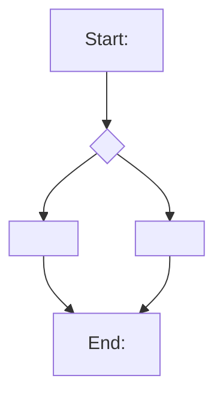

# flows-from-jobs — ATOM-06: JTBD-to-Mermaid Flowchart Generator

Generates one Mermaid `flowchart TD` diagram per JTBD from the Stage 1 job stories.
Each flow maps the trigger → decision path → action → outcome for one user job.

**FID-02:** No `style`, `fill`, `color`, `stroke`, or `classDef` directives in
any Mermaid flow. Text-node labels only.

**Mermaid format:** `flowchart TD` only. Do NOT use `stateDiagram-v2` at Stage 2
(that is Stage 4). Do NOT reference Excalidraw or XState — those are Stage 3/4.

---

## Standalone bootstrap

When invoked directly (without a stage-1 bundle or prior context):

Ask the user:
1. "What is the product or feature? (2-3 sentences)"
2. "Name 2-3 user tasks you want to map as flowcharts."
3. "For each task: what triggers the user to start? What decision do they face?
   What do they do? What outcome do they want?"

Do not generate flows until answers are received. These replace the JTBD corpus.

---

## Workflow procedure

Steps for invocation from within the `structure` workflow:

**1. Read JTBD list**

Primary source: `artifactsInventory` from `design/.handoff/stage-1-bundle.md`.
Extract all entries with paths matching `research/jobs/*.jtbd.md`.
Fallback: glob `design/research/jobs/*.jtbd.md` and read each file.

For each JTBD, extract:
- `slug`: filename without extension (e.g., `checkout` from `checkout.jtbd.md`)
- `title` or job statement: the "When I... I want to... so that..." phrasing

**2. Generate one flowchart per JTBD**

For each JTBD, generate a `flowchart TD` diagram following this pattern:



Rules:
- Node IDs: single uppercase letters or short camelCase identifiers (A, B, C...)
- Node labels: wrapped in `[]` (rectangle), `{}` (diamond for decisions), or `(())` (circle)
- Edge labels: short phrases on `-->|label|` arrows for decision branches
- No `style`, `fill`, `color`, `stroke`, `classDef`, or `:::style` modifiers
- No subgraphs in Stage 2 flows (keep simple; subgraphs ship in Stage 4)
- Minimum 3 nodes; maximum ~12 nodes per flow (more than 12 → split into sub-flows)

FID-02 example of what to NEVER write:
```
style A fill:#ff0000   ← FORBIDDEN
classDef primary fill:blue  ← FORBIDDEN
A:::primary  ← FORBIDDEN
```

**3. Write flow files**

Write each flow to the staging area:
`<staging-dir>/ia/flows/<jtbd-slug>.flow.mmd`

Example: `checkout.jtbd.md` → `ia/flows/checkout.flow.mmd`

**4. Validate Mermaid syntax**

For each generated flow file, attempt render:

```bash
node bin/design-os.mjs mermaid-render --input <path>.flow.mmd --output /dev/null
```

If the command exits non-zero, the Mermaid syntax is invalid. Note the error.
The `structure` workflow manages repair cycles (max 2 LLM retries before halting).
This atom is responsible for generation and reporting errors — not for repair.

**5. Report status**

Return a list of flow files generated:
- File path
- JTBD slug
- Node count
- Validation status (valid / error: <message>)
