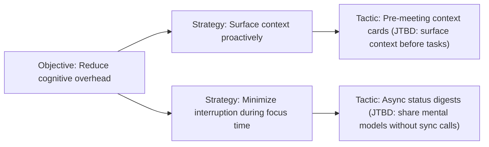

# build-ost — ATOM-04: Opportunity Solution Tree Builder

Builds a Torres Opportunity Solution Tree from stage-1 personas, mapping persona
objectives to strategies and tactics. Emits as a Mermaid `flowchart LR` diagram.

---

## Standalone bootstrap

When invoked directly (without prior persona files):

Ask the user:
1. "Describe your primary user archetype in 2-3 sentences."
2. "What is the single most important outcome they want to achieve?"
3. "What are 2-3 strategies (approaches) they might use to reach that outcome?"

If `design/research/personas/` exists, read those files instead of asking.

---

## Workflow procedure

Steps for invocation from within the `discover` workflow:

**1. Read persona files**

Read all files matching `design/research/personas/*.persona.json`. Extract:
- Persona name
- `thinkingStyle.cognitiveSpace` — grounds the objective identification
- `thinkingStyle.guidingPrinciples` — informs strategy choices
- `jobsToBeDone` — maps to tactics in the OST

**2. Load OST format reference**

Read `${CLAUDE_SKILL_DIR}/references/torres-ost.md` for the Opportunity Solution Tree structure:
- **Objective**: the desired outcome (user-goal level, not feature level)
- **Strategy**: a general approach toward the objective (multiple per objective)
- **Tactic**: a specific action or feature area enabling the strategy

**3. Construct OST**

For each persona:
- Identify 1-2 primary objectives from their `cognitiveSpace` and `guidingPrinciples`.
  Objectives must be outcome-framed, not solution-framed.
  Good: "Reduce cognitive overhead when context switches"
  Bad: "Build a context panel" (solution-framed)
- For each objective, identify 2-3 strategies.
- For each strategy, identify 1-2 tactics grounded in the persona's JTBDs.

**4. Emit Mermaid flowchart**

Write `design/research/ost.mmd` as a Mermaid `flowchart LR` diagram:



Node IDs: O (objective), S (strategy), T (tactic) with numeric suffixes.
Keep node labels ≤60 chars. Use JTBD references in tactic labels.

**5. Validate Mermaid syntax**

If `assets/scripts/mermaid-render.mjs` is available:
```bash
node assets/scripts/mermaid-render.mjs design/research/ost.mmd
```
If it exits non-zero, fix the syntax error before proceeding.
