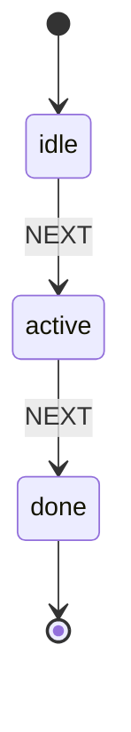

# Sample Interaction Spec

## stateDiagram-v2

## States

| State | Description |
|-------|-------------|
| idle | Initial state — awaiting user action |
| active | User has initiated the flow |
| done | Flow complete |
